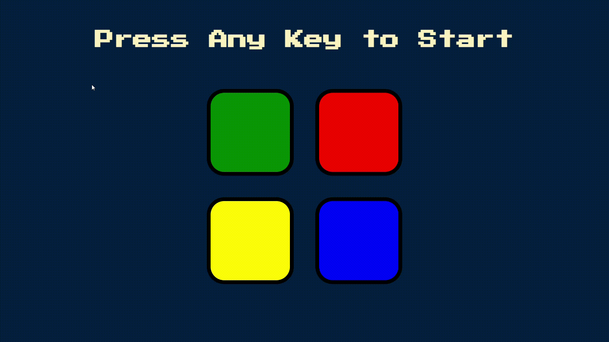

# Simon Game

## Introduction
A web-based implementation of the Simon Game, where players must remember and repeat a series of button presses.

## How to Play
- Turn on the game by pressing any button on your keyboard.
- The game will randomly flash a button. Now click on this button.
- Now game will again flash another button. Click the first button and then this button.
- Now, Click the buttons in the same order that you saw and heard them flash and play sounds.
- If you correctly repeat the sequence, the game will generate a longer sequence for you to try again.
- The game will continue until you make a mistake by clicking wrong button.

## Technologies Used
- HTML
- CSS
- JavaScript
